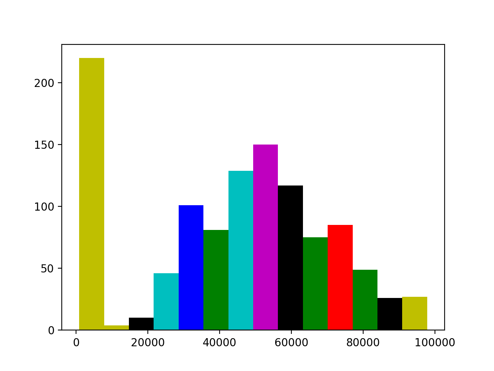
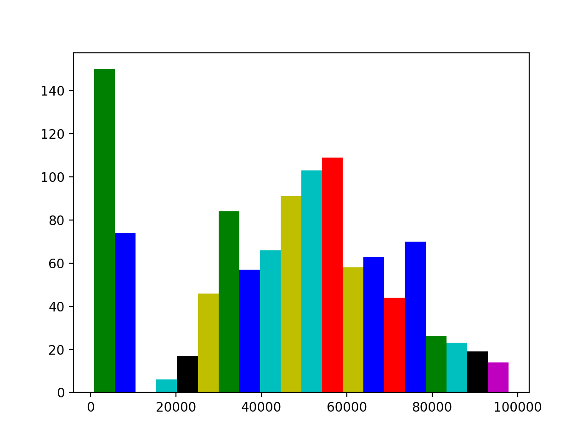

# Discogram
A joke histogram with random colours and random number of bins (number of groups of data) done in Matplotlib and Numpy. This was coded specifically for Python version 3.x and the coe dataset provided. Modify if you wish!

## Download Numpy and Matplotlib
To get in on the joke, go to your _terminal_ or _command prompt_ and ensure you have Matplotlib and Numpy downloaded:  
`pip install numpy`
`pip install matplotlib`

Alternatively you can use the requirements.txt I have provided:  
`pip install -r requirements.txt`

## Party time!!! 🕺🕺🕺
What you should see:

   

